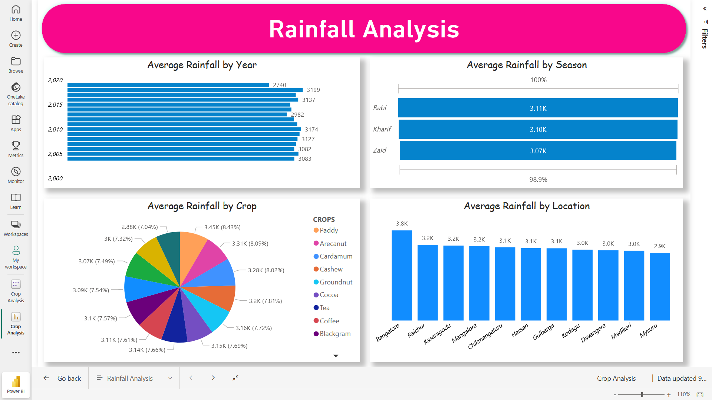
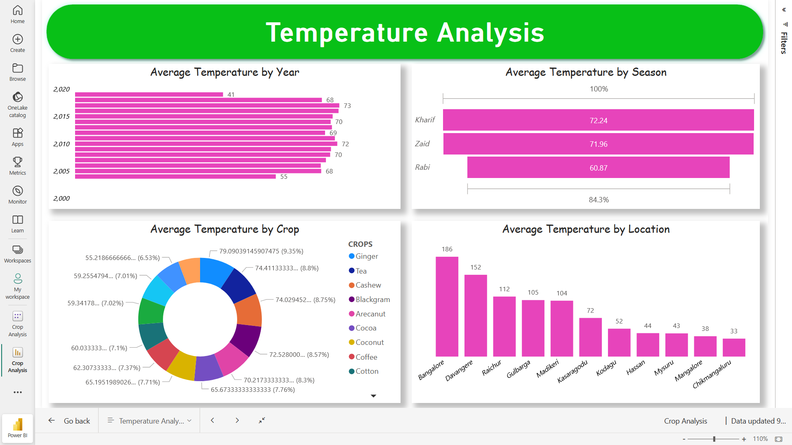
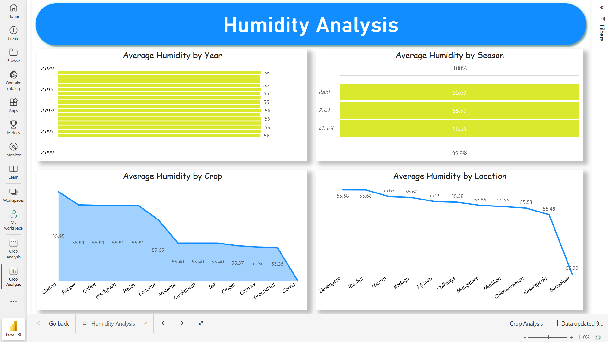
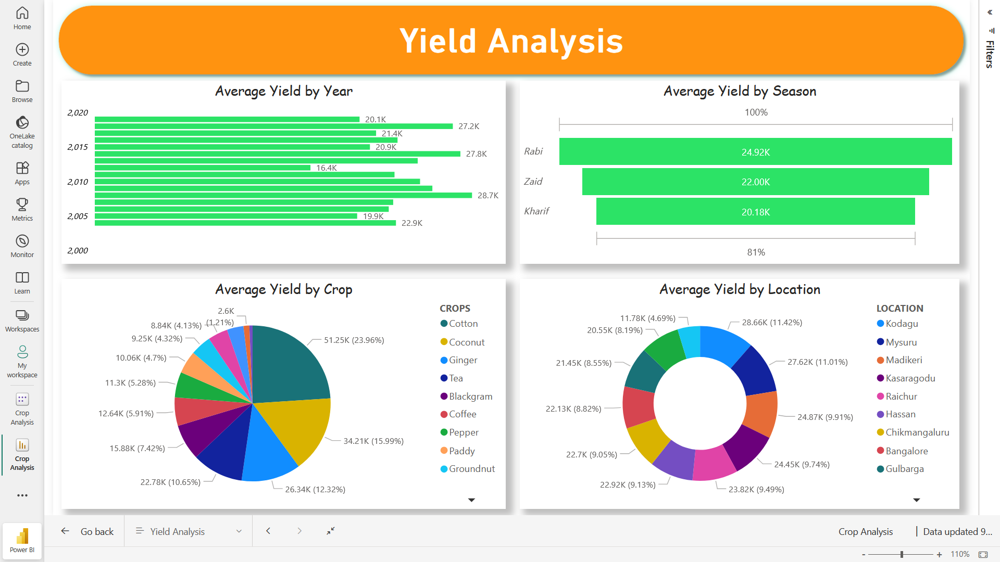

# 🌾 Agriculture Data Analytics Dashboard  

This project demonstrates an **end-to-end data pipeline and interactive dashboard** using **AWS S3, Snowflake, and Power BI**.  
The dashboard provides insights into **Rainfall, Temperature, Humidity, and Crop Yield** across multiple dimensions.  

🔗 **Live Dashboard:** [View on Power BI](https://app.powerbi.com/view?r=eyJrIjoiMGU4N2Q5ZmEtMGY4Zi00NTRkLWFhYzAtMjE4MzQ2ZWRlOTMxIiwidCI6IjM4ZjYyOTI2LTc1NTktNGFlZi04NGFlLWNiNWUxNzI0MDZmYiJ9)  

---

## 📊 Dashboard Pages  

### 1️⃣ Rainfall Analysis (Average Rainfall)  
  

---

### 2️⃣ Temperature Analysis (Average Temperature)  
  

---

### 3️⃣ Humidity Analysis (Average Humidity)  
  

---

### 4️⃣ Yield Analysis (Average Yield)  
  

---

## 🚀 Setting Up the Project  

### Creating a New S3 Bucket  
1. Open the **AWS S3 Console** and click **Create Bucket**.  
2. Choose a **unique bucket name** (e.g., `powerbi.project`).  
   - Note: bucket names must be lowercase only.  
3. Leave the region as default (e.g., `US East (N. Virginia)`) or choose your preferred region.  
4. Scroll down and click **Create Bucket**.  

---

### Uploading Data to the S3 Bucket  
1. Open the newly created bucket (`powerbi101.project`).  
2. Click **Upload** → **Add files**.  
3. Select your dataset file (`data_sess.csv`).  
4. Click **Upload**.  
5. Once complete, your data is available in S3.  

---

### Creating the IAM Role  
1. Go to **IAM Console** → **Roles** → **Create Role**.  
2. Choose **AWS account** as the trusted entity type.  
3. Enter an **External ID** (temporary placeholder; will update later with Snowflake-provided External ID).  
4. Attach **AmazonS3FullAccess** (or restricted S3 access to your bucket).  
5. Name the role `powerbi101.role` (or similar).  
6. Click **Create Role**.  

---

### Creating the Integration Object in Snowflake  
1. In Snowflake, create a **Storage Integration**:  
   ```sql
   CREATE OR REPLACE STORAGE INTEGRATION PBI_integration
   TYPE = EXTERNAL_STAGE
   STORAGE_PROVIDER = S3
   ENABLED = TRUE
   STORAGE_AWS_ROLE_ARN = '<IAM_ROLE_ARN>'
   STORAGE_ALLOWED_LOCATIONS = ('s3://powerbi.project/');
   COMMENT = 'Integration with AWS S3 for Power BI project';

2. Run
   ```sql
   DESC STORAGE INTEGRATION PBI_integration;
   
   This will return two important values:
   AWS IAM User ARN
   External ID
   
### Finding the ARN and Bucket Details

1. In AWS Console → IAM → Roles → powerbi.role → Copy the Role ARN.
2. In AWS Console → S3 → Buckets, confirm your bucket name (e.g., powerbi.project).
3. Update the Snowflake integration object code with your Role ARN and Bucket Name.

### Updating the Trust Policy for the Role

1. Open AWS Console → IAM → Roles → powerbi.role.
2. Navigate to Trust Relationships → Edit Trust Policy.
3. Replace the ARN with the Snowflake-provided AWS IAM User ARN.
4. Replace the External ID with the one provided by Snowflake (DESC STORAGE INTEGRATION result).
5. Save changes.

### Connecting Snowflake with Power BI

1. Open Power BI Desktop.

2. Select Get Data → Snowflake.

3. Provide Snowflake Server URL and Warehouse.

3. Load your table (crops_data).

4. Create dashboards and publish to Power BI Service.

### 🛠️ Tech Stack

AWS S3 – Cloud storage for raw dataset

Snowflake – Cloud data warehouse for query & transformation

Power BI – Visualization & dashboarding

### 📌 Key Learnings

Creating S3 Buckets & uploading data

Configuring IAM Roles and Trust Policies for secure AWS-Snowflake connection

Using Snowflake Storage Integrations and Stages

Building and publishing multi-page Power BI dashboards